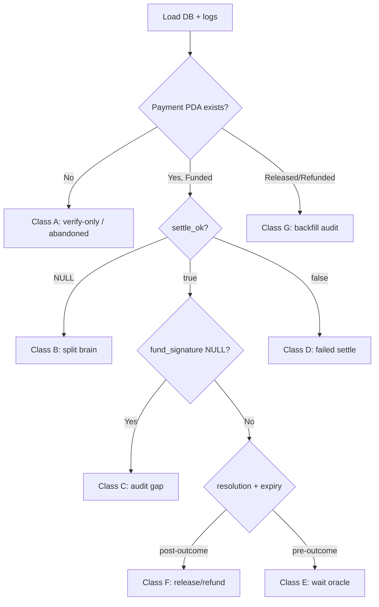

# SLA-Escrow ops recovery playbook

Manual runbook for **abnormal, corner, and split-brain cases** in pr402’s sla-escrow rail. Use when automation (verify/settle handlers, settlement cron, vault sweep) leaves the database inconsistent with chain reality, or when a payment appears “stuck.”

**Audience:** operators with `DATABASE_URL`, Vercel log access, `CRON_SECRET`, and cluster RPC.

**Related docs:**

- [CRON_OPERATIONS.md](./CRON_OPERATIONS.md) — settlement keeper schedules, cron auth, dry-run
- [deploy/settlement-keeper/README.md](../deploy/settlement-keeper/README.md) — standalone worker + `chain_scan`
- [SLA_ESCROW_FEE_PAYER_AND_SETTLE.md](./SLA_ESCROW_FEE_PAYER_AND_SETTLE.md) — fund vs settle semantics

---

## 1. Golden rules

1. **On-chain state is the source of truth for money.** Postgres is an index and audit log. USDC in a Funded `Payment` PDA is not lost because a DB column is NULL.
2. **For sla-escrow, `verify_ok` is not payment.** Verify only validates the unsigned FundPayment shell. **Do not ship goods / grant access until funding is confirmed** (`settle_ok = true` + `settlement_signature`, or an explicit on-chain Funded check).
3. **`payment_uid_hex` at verify time does not prove funding.** It is parsed from the *intended* FundPayment instruction in the verify payload. A row can have `payment_uid_hex` set while the Payment PDA does not exist on-chain (buyer abandoned after verify).
4. **Settlement cron is DB-indexed by default.** It selects rows where `escrow_details.fund_signature IS NOT NULL` **and** `payment_uid_hex IS NOT NULL`. Rows missing either field are **skipped**, not “failed.”
5. **Manual release does not require a healthy DB row.** `POST /build-sla-escrow-settle-tx` only needs `paymentUidHex` and reads the Payment PDA from RPC.
6. **Never refund or release without reading on-chain `resolution_state` and expiry.** The program enforces authorization; operators must follow the same decision matrix as the cron (see §8).

---

## 2. Data model (what each field means)

### `payment_attempts`

| Column | Set when | Meaning |
|--------|----------|---------|
| `verify_ok` | `/verify` handler | Tx simulation / validation passed |
| `settle_ok` | `/settle` handler | **`NULL`** = settle never recorded; **`true`** = settle path returned success; **`false`** = settle failed and was recorded |
| `settlement_signature` | `/settle` success | On-chain **FundPayment** tx signature |
| `correlation_id` | verify (minted or client-supplied) | Primary key for ops lookups |

### `escrow_details` (one row per `payment_attempt_id`)

| Column | Set when | Meaning |
|--------|----------|---------|
| `payment_uid_hex` | verify audit (and settle audit refresh) | 64-char hex; seeds Payment PDA |
| `fund_signature` | settle audit only | Same as fund tx sig; **NULL is normal after verify-only** |
| `completed_at` / `refunded_at` | lifecycle step or cron | pr402’s view of terminal settlement |
| `resolution_state` | confirm_oracle lifecycle | 0 Pending, 1 Approved, 2 Rejected |

### Cron eligibility (`list_sla_escrow_settle_candidates`)

All must hold:

- `fund_signature IS NOT NULL`
- `payment_uid_hex IS NOT NULL`
- `completed_at IS NULL` AND `refunded_at IS NULL`
- `updated_at` older than cooldown; `created_at` within lookback window

---

## 3. Failure taxonomy

| Class | DB fingerprint | On-chain (typical) | Seller revenue at risk? |
|-------|----------------|------------------|-------------------------|
| **A — Verify-only / abandoned** | `verify_ok=true`, `settle_ok=NULL`, `fund_signature=NULL` | Payment PDA **not found** | **No** — buyer never funded |
| **B — Split brain (settle on-chain, DB unsettled)** | `verify_ok=true`, `settle_ok=NULL`, `fund_signature=NULL` | Payment PDA **Funded** | **Yes** — until ReleasePayment |
| **C — Settle recorded, audit incomplete** | `settle_ok=true`, `settlement_signature` set, `fund_signature=NULL` | Funded | **Yes** — cron blind, chain has funds |
| **D — Settle failed (recorded)** | `settle_ok=false`, `settle_error` set | Usually not Funded | **No** — retry settle with buyer |
| **E — Funded, pre-outcome** | Happy DB row, cron runs | Funded, `resolution_state=0`, not expired | **No** — wait for oracle / expiry rules |
| **F — Funded, post-outcome, cron stuck** | Eligible row, cron errors | Approved or expired-delivered | **Yes** — manual settle |
| **G — Released on-chain, DB stale** | `completed_at NULL` | `state=Released` | **No** for funds — fix audit only |
| **H — Legacy index gap** | `payment_uid_hex=NULL` | May be Funded | **Maybe** — use chain_scan or manual uid recovery |

**Real example (Class A):** `payment_attempt_id=3`, `correlation_id=01KSJC6CYPZVK5RQCNGTKP7DWA`, `payment_uid_hex=cae250ac…`, Payment PDA `account_not_found` on RPC → verify-only, no ops action required for revenue.

---

## 4. Universal triage (every incident)

Run this before choosing a playbook.

### 4.1 Load DB row

```sql
SELECT
  pa.id,
  pa.correlation_id,
  pa.verify_ok,
  pa.verify_at,
  pa.settle_ok,
  pa.settle_at,
  pa.settle_error,
  pa.settlement_signature,
  pa.scheme,
  pa.amount,
  pa.asset,
  pa.payer_wallet,
  ed.payment_uid_hex,
  ed.fund_signature,
  ed.escrow_pda,
  ed.bank_pda,
  ed.oracle_authority,
  ed.resolution_state,
  ed.delivery_signature,
  ed.resolution_signature,
  ed.completed_at,
  ed.refunded_at
FROM payment_attempts pa
LEFT JOIN escrow_details ed ON ed.payment_attempt_id = pa.id
WHERE pa.correlation_id = '<CORRELATION_ID>'
   OR pa.id = <PAYMENT_ATTEMPT_ID>;
```

### 4.2 Derive Payment PDA and check chain

```bash
cd pr402
pip3 install -r scripts/requirements-ops.txt   # once

python3 scripts/derive_sla_escrow_pda.py \
  --program-id "$SLA_ESCROW_PROGRAM_ID" \
  --bank-pda "<bank_pda from escrow_details>" \
  --payment-uid-hex "<payment_uid_hex from escrow_details>" \
  --rpc "$SOLANA_RPC_URL"
```

Interpret `on_chain`:

| RPC result | Meaning |
|------------|---------|
| `account_not_found` | Never funded **or** wrong program/bank/cluster |
| `state=0 (Funded)` | Buyer paid; escrow holds funds |
| `state=1 (Released)` | Seller paid (or expiry branch) |
| `state=2 (Refunded)` | Buyer refunded |
| `state=3 (Closed)` | Terminal; rent reclaimed |

**Cluster check:** confirm `GET /api/v1/facilitator/health` → `solanaNetwork` matches the RPC you use (mainnet vs devnet). Wrong cluster looks like “wrong PDA.”

### 4.3 Search facilitator logs

In Vercel (target `server_log`), grep `correlation_id`:

| Log line | Implication |
|----------|-------------|
| `verify ok` | Class A/B/C/D possible |
| `settle ok` + `settlement_signature` | Settle handler finished; if DB lacks sig → persistence bug |
| `Settlement failed:` | Class D |
| `extract_escrow_audit_metadata failed` | Class C — audit warn-only after settle |
| `record_payment_settle skipped` | DB pool/timeout — possible Class B |
| *(no settle line)* | Class A or B — chain check decides |

### 4.4 Classify and branch



---

## 5. Scenario playbooks

### 5.A Verify-only / abandoned (no Payment PDA)

**Symptoms:** `verify_ok=true`, `settle_ok=NULL`, `fund_signature=NULL`, RPC `account_not_found`.

**Revenue impact:** None.

**Actions:**

1. **Do nothing** for settlement or release.
2. Tell merchant: payment not completed; do not fulfill.
3. Optional hygiene (no protocol requirement):

```sql
-- Reporting only: identify stale verify rows (adjust interval)
SELECT pa.id, pa.correlation_id, pa.verify_at, ed.payment_uid_hex
FROM payment_attempts pa
LEFT JOIN escrow_details ed ON ed.payment_attempt_id = pa.id
WHERE pa.scheme ILIKE '%escrow%'
  AND pa.verify_ok = true
  AND pa.settle_ok IS NULL
  AND pa.verify_at < NOW() - INTERVAL '24 hours';
```

**Do not** backfill `fund_signature` or call `build-sla-escrow-settle-tx` without a Funded on-chain account.

---

### 5.B Split brain — Funded on-chain, `settle_ok` NULL

**Symptoms:** Payment PDA Funded; DB never recorded settle (`settle_ok NULL`, `settlement_signature NULL`).

**Cause:** Client timeout, Vercel function killed after tx confirm, or `record_payment_settle` error after broadcast.

**Revenue impact:** High — funds locked until ReleasePayment.

**Recovery (order):**

1. **Find fund tx signature on-chain** (not in DB):
   - Explorer: Payment PDA → transactions → FundPayment
   - RPC: `getSignaturesForAddress` on Payment PDA, oldest signature is usually fund

2. **Release/refund via chain-only API** (does not need DB fix first):

```bash
curl -sS -X POST "$PR402_BASE_URL/api/v1/facilitator/build-sla-escrow-settle-tx" \
  -H "Content-Type: application/json" \
  -d '{"paymentUidHex":"<64-char-hex>"}' | jq .
```

- `action: release_payment` or `refund_payment` → broadcast `unsignedTransaction` (facilitator-signed).
- `skip_pre_outcome` → oracle has not ruled; go to §5.E.

3. **Backfill DB** after confirming fund tx:

```sql
UPDATE payment_attempts
SET settle_at = NOW(),
    settle_ok = true,
    settlement_signature = '<FUND_TX_SIGNATURE>',
    updated_at = NOW()
WHERE correlation_id = '<CORRELATION_ID>';

UPDATE escrow_details ed
SET fund_signature = '<FUND_TX_SIGNATURE>',
    updated_at = NOW()
FROM payment_attempts pa
WHERE ed.payment_attempt_id = pa.id
  AND pa.correlation_id = '<CORRELATION_ID>';
```

4. **Record lifecycle** if release/refund tx was submitted manually:

```bash
export DATABASE_URL='...'
cargo run --bin record_escrow_lifecycle -- release-payment \
  --correlation-id '<CORRELATION_ID>' \
  --tx-signature '<RELEASE_OR_REFUND_TX_SIG>'
```

---

### 5.C Settle recorded, `fund_signature` NULL (audit extract failure)

**Symptoms:** `settle_ok=true`, `settlement_signature` present, `fund_signature=NULL` (may also lack `payment_uid_hex` if verify audit also failed).

**Cause:** `extract_escrow_audit_metadata` failed after settle (historically: wrong FundPayment instruction index; fixed in commit `658f7dc` for new txs).

**Revenue impact:** Medium — cron skips row; chain may still be Funded.

**Recovery:**

1. Confirm Payment PDA Funded (§4.2).
2. Backfill from existing `settlement_signature`:

```sql
UPDATE escrow_details ed
SET fund_signature = pa.settlement_signature,
    payment_uid_hex = COALESCE(
      ed.payment_uid_hex,
      '<64-char-hex from verify audit or re-parse fund tx>'
    ),
    updated_at = NOW()
FROM payment_attempts pa
WHERE ed.payment_attempt_id = pa.id
  AND pa.correlation_id = '<CORRELATION_ID>'
  AND pa.settle_ok = true
  AND pa.settlement_signature IS NOT NULL;
```

3. Trigger cron dry-run to confirm candidate appears:

```bash
PR402_BASE_URL=https://your-host CRON_SECRET=... \
  ./scripts/trigger-settlement-crons.sh dry-run
```

4. If post-outcome, run live cron or §5.F manual settle.

**Re-parse `payment_uid_hex` from fund tx:** use Solana explorer instruction data for FundPayment, or redeploy fixed facilitator and re-run extract in a controlled environment. The uid bytes are the 32-byte field in the FundPayment instruction body.

---

### 5.D Settle failed (`settle_ok=false`)

**Symptoms:** `settle_error` populated, no FundPayment on-chain.

**Actions:**

1. Read `settle_error` and Vercel logs.
2. Buyer re-submits `/settle` with the same signed payload (idempotent paths exist for some fee-payer modes).
3. Do not backfill `fund_signature`.
4. Merchant: still not paid.

---

### 5.E Funded, pre-outcome (oracle pending)

**Symptoms:** Payment PDA Funded, `resolution_state=0` (Pending), not expired; `build-sla-escrow-settle-tx` returns pre-outcome skip.

**Actions:**

1. **Wait** for oracle `ConfirmOracle` on-chain.
2. Track delivery: `SubmitDelivery` must land before expiry for expired-delivered release branch.
3. Cron **correctly skips** — permissionless release/refund applies only post-outcome or post-expiry per [sla-escrow-onchain-abi NORMATIVE §5.3/§5.4](https://github.com/miraland-labs/x402/blob/main/oracles/spec/sla-escrow-onchain-abi/v1/NORMATIVE.md).

**Manual DB record** (audit only, if txs happened outside pr402):

```bash
cargo run --bin record_escrow_lifecycle -- submit-delivery \
  --correlation-id '<CID>' \
  --tx-signature '<SIG>' \
  --delivery-hash '<64-hex>'

cargo run --bin record_escrow_lifecycle -- confirm-oracle \
  --correlation-id '<CID>' \
  --tx-signature '<SIG>' \
  --delivery-hash '<64-hex>' \
  --resolution-state 1
```

---

### 5.F Funded, post-outcome — cron not releasing

**Symptoms:** Oracle Approved (`resolution_state=1`) or expired with delivery; DB row eligible OR chain shows releasable state; seller not paid.

**Path 1 — Fix DB index, use cron**

1. Ensure §5.B or §5.C backfill complete (`fund_signature` + `payment_uid_hex`).
2. Live cron:

```bash
PR402_BASE_URL=https://your-host CRON_SECRET=... \
  ./scripts/trigger-settlement-crons.sh live
```

**Path 2 — Manual settle (fastest)**

```bash
curl -sS -X POST "$PR402_BASE_URL/api/v1/facilitator/build-sla-escrow-settle-tx" \
  -H "Content-Type: application/json" \
  -d '{"paymentUidHex":"<hex>"}' | jq .
```

Broadcast returned tx; record lifecycle (§5.B step 4).

**Path 3 — Standalone keeper with chain_scan (DB-less discovery)**

```bash
export SETTLEMENT_KEEPER_SLA_ESCROW_SOURCE=chain_scan
export SOLANA_RPC_URL=...
export FACILITATOR_KEYPAIR_BASE58=...
export SLA_ESCROW_PROGRAM_ID=...
cargo run --release --bin settlement-keeper
```

Scans all Funded Payment PDAs on-chain; does not require `fund_signature` in Postgres. See [deploy/settlement-keeper/README.md](../deploy/settlement-keeper/README.md).

**Settlement decision matrix** (permissionless paths only):

| `resolution_state` | Expired? | `delivery_timestamp` | Action |
|--------------------|----------|----------------------|--------|
| 1 Approved | any | any | ReleasePayment |
| 2 Rejected | any | any | RefundPayment |
| 0 Pending | yes | ≠ 0 | ReleasePayment (expired-delivered) |
| 0 Pending | yes | 0 | RefundPayment (expired-undelivered) |
| 0 Pending | no | any | **Skip** (pre-outcome) |

---

### 5.G Released/refunded on-chain, DB stale

**Symptoms:** Payment PDA terminal; `completed_at` / `refunded_at` still NULL in `escrow_details`.

**Revenue impact:** None if chain terminal — accounting/reporting only.

**Actions:**

1. Find release/refund tx on explorer.
2. Backfill:

```bash
cargo run --bin record_escrow_lifecycle -- release-payment \
  --correlation-id '<CID>' \
  --tx-signature '<SIG>'
# or refund-payment
```

Non-fatal if this fails after chain tx — cron detects `skip_already_settled` on next run.

---

### 5.H Legacy row — `payment_uid_hex` NULL

**Symptoms:** Old row before migration `007_escrow_payment_uid.sql`; cron always skips.

**Recovery:**

1. Recover uid from FundPayment tx (explorer / RPC parse).
2. Update `escrow_details.payment_uid_hex` and `fund_signature`.
3. Or use `chain_scan` keeper + manual settle with recovered uid.

---

## 6. Tool reference

| Tool | Purpose |
|------|---------|
| [`scripts/derive_sla_escrow_pda.py`](../scripts/derive_sla_escrow_pda.py) | Derive bank / payment / escrow PDAs; optional RPC state check |
| [`scripts/trigger-settlement-crons.sh`](../scripts/trigger-settlement-crons.sh) | Dry-run or live vault + sla-escrow settle crons |
| `POST .../build-sla-escrow-settle-tx` | Build signed Release/Refund tx from `paymentUidHex` only |
| `POST .../sla-escrow-settle` | Operator cron with `{ "dryRun": true, "limit": N }` |
| `cargo run --bin record_escrow_lifecycle` | Backfill lifecycle + `completed_at` / `refunded_at` |
| `cargo run --release --bin settlement-keeper` | Long-running worker; `chain_scan` mode |
| Solana explorer | Fund / release tx signatures, instruction decode |

---

## 7. SQL cookbook

### Stuck escrow candidates (automation should pick up)

```sql
SELECT pa.correlation_id, ed.payment_uid_hex, ed.fund_signature,
       ed.resolution_state, ed.completed_at, ed.refunded_at, ed.updated_at
FROM escrow_details ed
JOIN payment_attempts pa ON pa.id = ed.payment_attempt_id
WHERE ed.fund_signature IS NOT NULL
  AND ed.payment_uid_hex IS NOT NULL
  AND ed.completed_at IS NULL
  AND ed.refunded_at IS NULL
ORDER BY ed.updated_at ASC;
```

### Class B/C detector (needs ops attention)

```sql
-- settle_ok true but missing fund_signature
SELECT pa.id, pa.correlation_id, pa.settlement_signature, ed.payment_uid_hex
FROM payment_attempts pa
JOIN escrow_details ed ON ed.payment_attempt_id = pa.id
WHERE pa.scheme ILIKE '%escrow%'
  AND pa.settle_ok = true
  AND pa.settlement_signature IS NOT NULL
  AND ed.fund_signature IS NULL;

-- verify done, settle never recorded (investigate if old)
SELECT pa.id, pa.correlation_id, pa.verify_at, ed.payment_uid_hex
FROM payment_attempts pa
LEFT JOIN escrow_details ed ON ed.payment_attempt_id = pa.id
WHERE pa.scheme ILIKE '%escrow%'
  AND pa.verify_ok = true
  AND pa.settle_ok IS NULL
  AND pa.verify_at < NOW() - INTERVAL '1 hour';
```

### Confirm cron would select a row

```sql
SELECT pa.correlation_id, ed.*
FROM escrow_details ed
JOIN payment_attempts pa ON pa.id = ed.payment_attempt_id
WHERE pa.correlation_id = '<CID>'
  AND ed.fund_signature IS NOT NULL
  AND ed.payment_uid_hex IS NOT NULL
  AND ed.completed_at IS NULL
  AND ed.refunded_at IS NULL;
```

---

## 8. Log patterns (Vercel)

| Grep | Meaning |
|------|---------|
| `extract_escrow_audit_metadata failed` | Audit gap (Class C) |
| `upsert_escrow_detail failed` | escrow_details not updated |
| `record_payment_settle skipped` | settle_ok may stay NULL (Class B) |
| `settlement keeper sla-escrow settle cron finished` | Batch summary — check `failed` count |
| `apply_escrow_lifecycle_step failed` | On-chain tx may have succeeded; DB audit lag |
| `settlement keeper sla-escrow settle tx submitted` | Successful release/refund |

---

## 9. Merchant / integration guidance

**When is it safe to fulfill?**

| Signal | Safe to fulfill? |
|--------|------------------|
| `verify_ok` only | **No** |
| `settle_ok=true` + `settlement_signature` | **Yes** (DB view) |
| Payment PDA Funded on-chain | **Yes** (strongest) |
| `completed_at` set | Payment terminal — goods already paid out |

**Buyer retry:** same `correlation_id` across verify/settle when possible so audit rows join correctly.

---

## 10. Prevention and monitoring (recommended)

These are **not all implemented today**; listed in priority order for engineering follow-up.

1. **Write `settlement_signature` → `fund_signature` immediately after settle broadcast**, before optional metadata extract (eliminates Class C for new rows).
2. **Reconciliation job** (hourly): run Class B/C SQL; for each row with `payment_uid_hex`, RPC-check Payment PDA; alert or auto-backfill.
3. **`chain_scan` worker in production** as safety net when DB index drifts.
4. **Alert** on `extract_escrow_audit_metadata failed` within 5 minutes of `settle ok`.
5. **Dashboard** for verify-only rows older than 1h (usually Class A — noise — but surfaces Class B if chain Funded).

---

## 11. Quick reference card

```
TRIAGE:  SQL row → derive_sla_escrow_pda.py --rpc → classify A–H

NOT FUNDED (account_not_found):
  → No release. Merchant: not paid. Optional: ignore row.

FUNDED + settle_ok NULL (split brain):
  → Find fund sig on-chain → build-sla-escrow-settle-tx → backfill DB

FUNDED + settle_ok true + fund_signature NULL:
  → Backfill fund_signature from settlement_signature → cron or manual settle

POST-OUTCOME:
  → build-sla-escrow-settle-tx OR live cron OR chain_scan keeper

PRE-OUTCOME:
  → Wait for oracle; do not force release

ALREADY TERMINAL ON-CHAIN:
  → record_escrow_lifecycle only
```

---

## 12. Document history

| Date | Notes |
|------|-------|
| 2026-05 | Initial playbook; incorporates payment_attempt id=3 verify-only case, audit failure class, `derive_sla_escrow_pda.py` helper |
