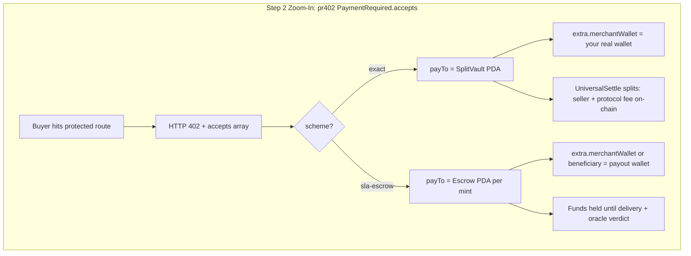

# pr402 `payTo` — Zoom-in brief (diagrams & seller messaging)

High-level **Web2 vs x402** infographics are useful, but they hide pr402’s most important differentiator: **`payTo` in the HTTP 402 `PaymentRequired` response is not “send USDC to the seller’s wallet.”** On pr402 (Solana), it is an **on-chain routing instruction** to a **program PDA** that enforces splits, protocol fees, escrow, and sustainable economics.

This doc is for:

- **Infographic / blog authors** zooming into “Step 2 — Request with Payment”
- **Sellers** moving from Stripe / bare-wallet x402 examples to pr402
- **ChatGPT / diagram tools** — use [§ ChatGPT script](#chatgpt-script-generate-the-zoom-in-diagram) at the bottom

**Canonical machine-readable spec:** `GET {BASE}/api/v1/facilitator/agent-payTo-semantics.json`

---

## Standard x402 vs pr402 (mental model)

### Generic x402 (CDP-style mental model)

```
Buyer ──► HTTP 402 ──► accepts[].payTo ≈ seller wallet (or facilitator-managed path)
         ──► sign & pay ──► facilitator verify/settle
         ──► gas often subsidized by a big operator
```

**Problem:** subsidized gas + “pay the wallet” does not scale. Someone must fund every transaction forever, and bare-wallet `payTo` does not encode protocol fee, escrow, or subscription windows.

### pr402 (Solana) — `payTo` is a program destination

When your API returns **HTTP 402**, the buyer/agent reads `accepts[]`. On pr402, **`payTo` is always an on-chain account owned by a pr402 program** — never “just paste your wallet and hope.”



| Field | Standard x402 (typical) | pr402 `exact` | pr402 `sla-escrow` |
|-------|-------------------------|---------------|---------------------|
| **`payTo`** | Often seller wallet / facilitator abstraction | **SplitVault PDA** (UniversalSettle) | **Escrow PDA** (per payment mint) |
| **Seller wallet** | Same as `payTo` in naive examples | In **`extra.merchantWallet`** only | In **`extra.merchantWallet`** / **`beneficiary`** — **not** `payTo` |
| **Protocol fee** | Opaque / subsidized elsewhere | **On-chain split** (90 bps sovereign / 100 bps JIT) | Escrow + oracle economics |
| **Gas / tx fees** | Often **subsidized** by operator | **Default: buyer pays** (`facilitatorPaysTransactionFees: false`) — sustainable BYOG | Same default; optional sponsorship gated |
| **Buyer protection** | Pay → hope seller delivers | Instant settle after verify | **Funds locked** until oracle confirms delivery |
| **Subscriptions** | N/A in generic diagram | One **`exact`** payment to vault PDA → seller issues **time-window JWT** | Rare; per-call / per-delivery use escrow |

---

## Zoom-in: Step 2 — “402 Payment Required”

### End-to-end flow (pr402)

```
Buyer/Agent                    Your API                      pr402 Facilitator
     |                            |                                  |
     |--- GET /api/premium ----->|                                  |
     |<-- 402 + accepts[] -------|  payTo = Vault/Escrow PDA        |
     |                            |  extra.merchantWallet = seller   |
     |--- build/sign tx ------------------------------------------->|
     |<-- unsigned tx + verifyBodyTemplate (optional) --------------|
     |                            |                                  |
     |--- GET /api/premium ----->|                                  |
     |    PAYMENT-SIGNATURE: …    |--- POST /settle --------------->|
     |                            |    (verify + on-chain execute)   |
     |                            |<-- 200 settled ------------------|
     |<-- 200 + resource ---------|                                  |
```

### Profound meaning: payment “diversion”

| Model | Where money goes first | Access |
|-------|------------------------|--------|
| **Traditional Web2** | Stripe / merchant account | API key after billing |
| **Naive x402** | Seller wallet (often subsidized gas) | Verify/settle → access |
| **pr402** | **Program vault PDA** (`payTo`) | On-chain enforce split/escrow → access |

**pr402 `payTo` diverts funds into a smart-contract vault** that:

1. **Routes payout** — seller share + protocol fee atomically on-chain (UniversalSettle on `exact`).
2. **Separates identity from destination** — your wallet is **`extra.merchantWallet`** (who earns); **`payTo`** is **where the program accepts funds** (how it’s enforced).
3. **Enables `sla-escrow`** — `payTo` = escrow PDA; release/refund is program + oracle logic, not trust.
4. **Powers x402 subscriptions** — one payment to the **same vault `payTo`** on `/subscribe`; data routes use **JWT**, not per-request 402. See hub [`SUBSCRIPTION_PATTERN.md`](../../SUBSCRIPTION_PATTERN.md) (x402 workspace).
5. **Stays sustainable** — pr402 does **not** assume a large operator pays Solana gas forever; buyers bring their own fees unless explicitly sponsored.

### Why subsidized gas is unsustainable (diagram caption)

Standard x402 demos often show a facilitator paying every buyer’s network fee. That is a **loss-leader**, not a protocol invariant. pr402’s default is **BYOG (bring your own gas)**: the buyer signs and pays Solana fees; the facilitator verifies and settles. Optional fee sponsorship exists on some builds but is **gated** — not “free forever.”

### Rail-specific `payTo` (from `agent-payTo-semantics.json`)

**`exact` (UniversalSettle / SplitVault)**

- **kind:** `splitVault`
- **resolve:** `GET /api/v1/facilitator/sellers/{wallet}/rails/exact` → `vaultPda`
- **verify:** destination must match UniversalSettle split vault
- **use:** pay-per-call APIs, subscription purchase endpoints (`POST /subscribe?tier=…`)

**`sla-escrow`**

- **kind:** `escrowPda`
- **resolve:** `GET /api/v1/facilitator/sellers/{wallet}/rails/sla-escrow?asset=<mint>` → escrow PDA for that mint
- **payout wallet:** `extra.merchantWallet` or `extra.beneficiary` — **not** `payTo`
- **verify:** `payTo` must equal `derive_escrow_pda(mint, bank)`
- **use:** token delivery, high-value jobs, SLA-backed fulfillment (e.g. x402-buy-spl-token)

---

## Seller workflow (do not hand-craft PDAs)

1. Draft 402 with **your wallet pubkey** in `payTo` (**upgrade input only** — not buyer-facing).
2. `POST /api/v1/facilitator/payment-required/enrich` → facilitator returns **canonical vault/escrow PDA** + institutional `extra`.
3. Store that JSON; serve it on every unpaid request.

For `exact`, you can also resolve via:

```bash
curl -sS "$BASE/api/v1/facilitator/sellers/YOUR_PUBKEY/rails/exact" | jq .
```

**Buyer-facing 402 body example (`exact`):**

```json
{
  "x402Version": 2,
  "accepts": [{
    "scheme": "exact",
    "network": "solana:…",
    "asset": "<USDC_MINT>",
    "amount": "50000",
    "payTo": "<SPLIT_VAULT_PDA>",
    "maxTimeoutSeconds": 300,
    "extra": {
      "feePayer": "…",
      "programId": "…",
      "configAddress": "…",
      "feeBps": "100",
      "merchantWallet": "<YOUR_ACTUAL_WALLET>"
    }
  }]
}
```

> **Rule:** Never publish bare wallet as final `payTo` on pr402 `exact` rail. Buyers pay the **PDA**; the program + facilitator verify that destination.

**Further reading**

- [Seller quick start](../docs-site/seller-quick-start.md) — Step 1 (`payTo`) and Step 2 (`/payment-required/enrich`)
- [Start here · SplitVault model](../docs-site/start-here.md)
- [Choosing x402 on Solana](../docs-site/pr402-vs-alternatives.md) — fee / gas model vs CDP

---

## One-line takeaway for sellers

> **`payTo` on pr402 is where the buyer’s money enters the protocol** (vault or escrow PDA). **Your wallet is how you get paid** (`extra.merchantWallet`), not where buyers send funds. That diversion — from “merchant account / bare wallet” to **program-enforced routing** — is what makes pr402 sustainable, escrow-capable, and subscription-ready on Solana.

---

## ChatGPT script: generate the zoom-in diagram

Paste the block below into ChatGPT (or another diagram tool) to produce an accurate **Step 2 zoom-in**. Do not use generic x402 `payTo = wallet` examples.

```text
Create an infographic UPDATE: zoom into "Step 2 — Request with Payment / HTTP 402 PaymentRequired"
for pr402 on Solana (NOT generic x402). Audience: API sellers moving from Web2/Stripe to x402.

CONTEXT (must be accurate):
- pr402 facilitator: ipay.sh (mainnet), preview.ipay.sh (devnet)
- Two rails: "exact" (UniversalSettle / SplitVault) and "sla-escrow" (on-chain escrow + oracle)
- Standard x402 diagrams wrongly show payTo = seller wallet and subsidized gas forever — mark that as UNSUSTAINABLE
- pr402 default: buyer pays Solana network fees (BYOG); facilitator does NOT permanently subsidize all gas

ZOOM-IN PANEL TITLE:
"Inside HTTP 402: pr402 payTo semantics (not a wallet address)"

LEFT COLUMN — "What naive x402 shows":
- payTo = seller's Solana wallet
- Big facilitator subsidizes tx gas
- Caption: "Works in demos; unsustainable at global scale"

RIGHT COLUMN — "What pr402 requires":
Box 1 — scheme: exact
- payTo = SplitVault PDA (on-chain program account)
- extra.merchantWallet = seller's real wallet (attribution / payout identity)
- On settle: program splits payment → seller + protocol fee (90–100 bps)
- Use for: pay-per-call APIs, x402 subscriptions (pay once → JWT window)

Box 2 — scheme: sla-escrow
- payTo = Escrow PDA (per mint, e.g. USDC)
- extra.merchantWallet or beneficiary = seller payout wallet (NOT payTo)
- Funds locked until delivery + oracle verdict (release or refund)
- Use for: token delivery, high-value jobs, SLA-backed fulfillment

CENTER FLOW (vertical):
1. Buyer/Agent → GET /api/...
2. Server → HTTP 402 + JSON accepts[]
3. Highlight accepts[].payTo with callout: "PROGRAM VAULT — not Stripe, not bare wallet"
4. Buyer signs tx to payTo PDA
5. pr402 facilitator POST /verify + /settle
6. Server returns resource (+ PAYMENT-RESPONSE header)

SELLER CALLOUT BOX:
"Seller integration trick"
- Seller drafts 402 with wallet in payTo (input only)
- POST /payment-required/enrich → canonical vault PDA + extra injected
- Never publish bare wallet as final payTo on pr402 exact rail

FOOTER CONTRAST (one line):
Traditional: Pay merchant account → API key → access
pr402: Pay program vault (payTo) → on-chain enforce split/escrow → access

STYLE:
- Match emerald/teal fintech palette (pr402 brand)
- Use lock/shield icons on PDA boxes, wallet icon only on extra.merchantWallet
- Do NOT label payTo as "seller wallet"
- Add small Solana + HTTP 402 badges

OUTPUT:
One wide diagram (16:9) suitable for docs/blog; include a legend for PDA vs wallet vs facilitator.
```
